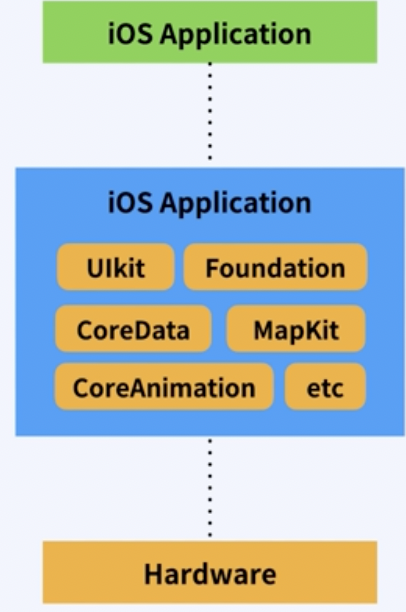

# 명언 생성기 앱

- 기능 상세
    - 버튼을 누를 때마다 랜덤 한 명언이 생성된다.
- 활용 기술
    - storyboard
    - AutoLayout
    - UILabel
    - UIButton

## 기술 기본 개념

### UIKit 알아보기

- Cocoa touch Framework : ios 개발 환경을 구축하기 위한 최상위 프레임워크



- UIKit : 사용자의 인터페이스를 관리하고 이벤트를 처리하는 프레임워크
    - UIKit 앱은 기본적으로 MVC 구조를 사용한다

 


- 현실 MVC
    - ViewController와 View를 구별하기 어렵다.
    - MVC 패턴말고 다른 패턴을 사용하는 것도 잘 어울린다.


### ViewController 알아보기

- UIView : 화면의 직사각형 영역에 대한 내용을 관리하는 개체


- ViewController : 앱의 근간을 이루는 객체로 모든 앱은 최소한 하나 이상의 뷰 컨트롤러를 가지고 있다.
    - 데이터 변화에 따라서 view 컨텐츠를 업데이트
    - view들과 함께 사용자 상호작용에 응답
    - view를 리사이징하고 전체적인 인터페이스의 레이아웃 관리
    - 다른 뷰컨트롤러들과 함께 앱을 구성한다.

### AutoLayout 알아보기

: 두 view의 사이를 제약조건(Constraints)를 이용해서 뷰의 위치를 지정하는 것

- 아이폰의 다양한 해상도 비율을 대응하기 위해 나온 개념

- Add New Constraint : 제약 조건 설정 가능


- Align : 두 개의 view 사이에 정렬 제약 조건 설정 가능


- Resolve Auto Layout Issues
    - view를 업데이트 하거나, 누락된 제약을 추가하거나 삭제 가능


- xcode 오른쪽 상단에서 preview 메뉴를 선택하면 다양한 해상도에서 viewController가 어떻게 보이는지 볼 수 있다.


### IBOutlet과 IBAction

- xcode 오른쪽 상단에서 Assistant 메뉴를 선택하면 storyboard의 viewController Scene과 연결된 viewController를 화면에 띄울 수 있다.
- ViewController와 Storyboard의 ViewController Scene을 연결하는 방법은 Storyboard의 CustomColass-Class의 칸에 ViewController의 이름을 넣어주면 된다.


- 스토리보드에서 해당 view를 마우스오른쪽 버튼을 누르고 viewController.siwft 파일로 드래그하면 Outlet을 연결할 수 있다.
- 색상변경을 위해 초록색 배경의 view의 outlet을 설정해주자. [ Name ] : colorView
- Outlet 설정시 Strong과 Weak를 설정해주는 것은 메모리 회수 정책에 따른다.
    - Strong 설정시 메모리 주소가 발생할 수 있다.


- 다음은 Button을 누르면 색상이 변경하는 Action을 생성하기 위해 버튼에 Action을 연결한다. [ Name ] : tapChangeColorButton
- type은 UIBUtton으로 설정한다.


 

# 명언생성기 앱

다음과 같이 storyboard Scene을 구성한다.


이때 constraints는 다음과 같이 설정한다.

명언생성기  top:20, leading:20, trailing: 20

view top:20, leading: 20, trailing :20

view 안의 상단 Label top:20, leading:20, trailing : 20

view 안의 하단 Label bottom:20, leading:20, trailing: 20

까지 한 후 view 안의 상단 Label에 bottom: 20을 추가하게 되면 화면처럼 오류가 발생한다.

이를 해결하기 위해 content hugging priority를 설정해줘야 한다. 지금은 서로 priority가 같기 때문에 둘은 같은 width, height를 유지하게 된다. 따라서 상단의 vertical priority를 더 낮게 설정해준다. (250으로 설정해주었다.)

조금 더 자세한 설명은 하단 링크를 참조한다.

[Content hugging vs Compression resistance 차이점 알기!](https://ontheswift.tistory.com/21)

 


다음과 같이 오류가 해결된 것을 확인할 수 있다.

그리고 상단 Label은 명언을 표시하기  위한 라벨이므로 여러줄이 포함될 수 있으므로 특성의 Lines에 0을 입력한다.

1이면 1줄, 2이면 2줄 … 까지 입력 가능하지만 0이면 여러 줄이 가능하다.

이때 엄청 길게 text를 입력하여 여러 줄이 되면 또 오류가 발생하는 것을 볼 수 있다.

아래 캡쳐를 보자.


이번 문자열을 표시하기에 부족한 공간 오류를 해결하기 위해서는 Content Compression Resistance Priority를 설정해줘야 한다. (이 Priority의 설명도 위의 링크에 같이 포함되어있다.)

두 label 중 어떤 size를 유지할지 설정해주자. 우선순위가 높으면 자신의 사이즈를 유지하게 된다.

하단 Label의 content Compression Resistance Priority의 vertical을 1000으로 설정해주면 해결 된다.


 이제 버튼 하나를 추가해주자.


버튼은 view와의 align을 통해 center horizontally를 설정해주고, top:20의 제약조건을 추가해준다.

이제 버튼을 누르면 명언을 생성할 수 있도록 ViewController.swift 파일을 작성해보자.

IBOutlet과 Action을 추가해주자

상단 Label의 이름은 quoteLabel로, 하단 Label의 이름은 nameLabel로, 버튼의 action 이름은 tqpQuoteGeneratorButton으로 추가한다.

```swift
import UIKit

class ViewController: UIViewController {

    @IBOutlet weak var quoteLabel: UILabel!
    @IBOutlet weak var nameLabel: UILabel!
    
    override func viewDidLoad() {
        super.viewDidLoad()
        // Do any additional setup after loading the view.
    }
    
    @IBAction func tapQuoteGenerateButton(_ sender: UIButton) {
    }
}
```

이제 명언을 가지고 있는 구조체를 생성해보자. 

Quote.swift 파일을 하나 만든다.

```swift
import Foundation

struct Quote {
    let contents: String
    let name: String
}
```

다음과 같이 작성 후 ViewController.swift 파일에 Quote 배열을 추가한다.

```swift
let quotes = [
	Quote(contents: "죽음을 두려워하는 나머지 삶을 시작조차 못하는 사람이 많다.", name: "벤다이크"),
	Quote(contents: "나는 나 자신을 빼 놓고는 모두 안다.", name:" 비용"),
	Quote(contents: "편견이란 실효성이 없는 의견이다.", name: "암브로스 빌"),
	Quote(contents: "분노는 바보들의 가슴속에서만 살아간다.", name: "아인슈타인"),
	Quote(contents: "몇 번이라도 좋다! 이 끔찍한 생이여...다시!", name: "니체")
]
```

이제 버튼을 누를 때 마다 랜덤하게 명언을 가져오게 만들자.

```swift
@IBAction func tapQuoteGeneratorButton(_ sender: UIButton) {
	let random = Int(arc4random_uniform(5)) // 0 - 4 사이의 난수들
	let quote = quotes[random]
	self.quoteLabel.text = quote.contents
	self.nameLabel.text = quote.name
}
```

모두 끝났다!

다음과 같이 버튼을 누를 때 마다 명언이 출력되는 완성된 화면을 볼 수 있다 :)

[화면 기록 2022-07-25 오후 4.39.21.mov](./ReadmeFiles/%25E1%2584%2592%25E1%2585%25AA%25E1%2584%2586%25E1%2585%25A7%25E1%2586%25AB_%25E1%2584%2580%25E1%2585%25B5%25E1%2584%2585%25E1%2585%25A9%25E1%2586%25A8_2022-07-25_%25E1%2584%258B%25E1%2585%25A9%25E1%2584%2592%25E1%2585%25AE_4.39.21.mov)
